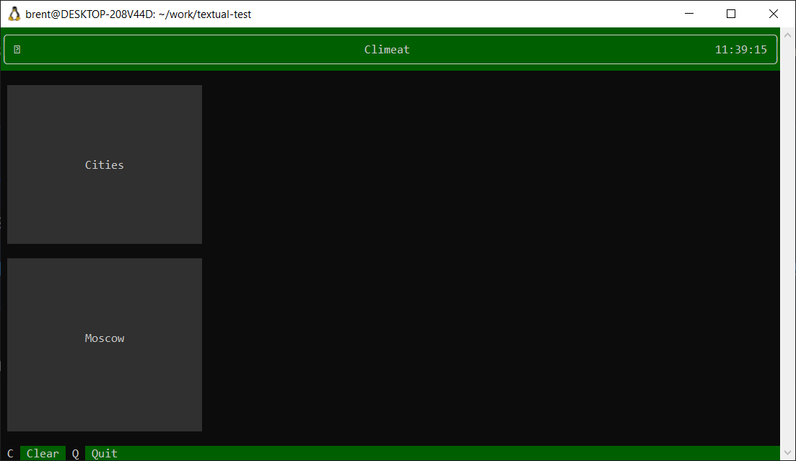

# Climeat textual app


In order to run this app, first create a python virtual environment

```
$ python -m venv venv
```

Then activate and install all the dependencies (requires python 3.7+)

```
$ source venv/bin/activate
$ pip install -r requirements.txt
```

once everything is installed you can enter the terminal app by running

```
$ python main.py
```




With the app running you can do a few things

1. Click on the Cities button to load the first 100 cities
2. Click on the Moscow button to load the moscow data
3. press c to clear the results screen
4. press q to quit the app

